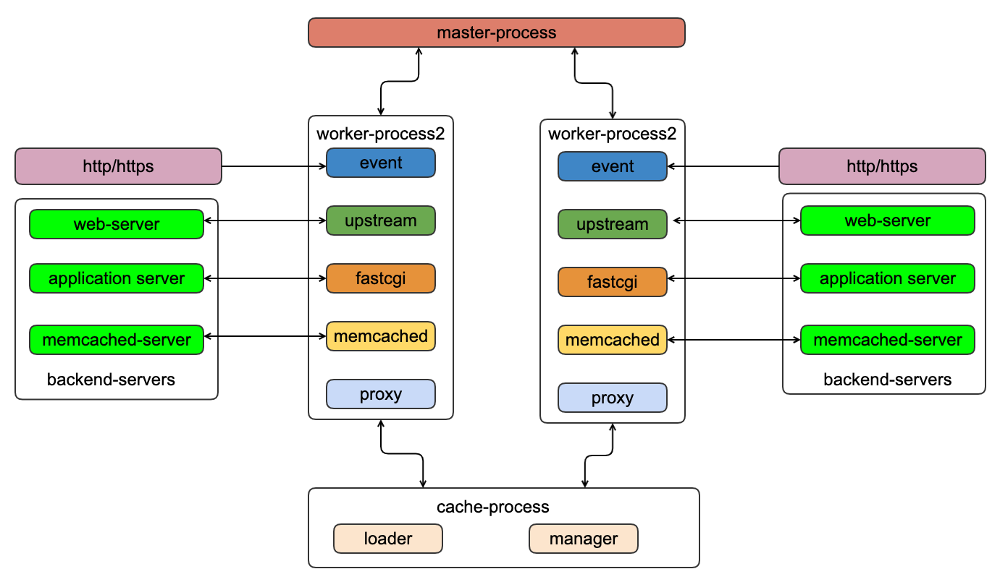

## nginx进程模型

### 整体架构



- 简单介绍
  - nginx最基本的进程有master进程和work进程，还可能会有cache相关进程。master进程和work进程之间进行通信来传递工作进程的控制信息。
  - nginx强大的模块功能，和外界服务器通信非常便捷，比如nginx的upstream和后端的Web服务器通信，依靠fastcgi与后端应用服务器通信
  
- 核心进程模型
  - nginx进程模型和大多数后台服务一样，分为管理进程和工作进程。管理进程主要是负责管理和监控工作进程，同时充当真个进程组合用户的交互接口;工作进程则是处理用户的这是请求。nginx启动后主进程充当了管理进程，而由管理进程fork出来的子进程充当了工作进程。
  - nginx多进程模型的入口是在ngx_master_process_cycle函数上，该函数做完信号处理设置后，会调用ngx_start_worker_processes函数用于fork子进程，每个子进程里面执行ngx_worker_process_cycle函数来处理请求，该函数是一个for(;;)循环，不断的处理来自客户端的请求，而主进程则继续执行gx_master_process_cycle.
  - 每个工作进程都有有一个for(;;)循环,以便进程持续等待和处理自己的负责的事务

	```
	//启动主进程的函数，该函数就是为了创建nginx的工作进程
	static void ngx_start_worker_processes(ngx_cycle_t *cycle, ngx_int_t n, ngx_int_t type)
	{
		    for (i = 0; i < n; i++) {
		
		    ngx_spawn_process(cycle, ngx_worker_process_cycle,
		                          (void *) (intptr_t) i, "worker process", type);
		}
	}
	//fork的封装函数，用户fork进程和在子进程中执行proc函数
	ngx_pid_t ngx_spawn_process(ngx_cycle_t *cycle, ngx_spawn_proc_pt proc, void *data,char *name, ngx_int_t respawn)
	{
		ngx_pid_t  pid;
		pid = fork();
		switch (pid) {
		case 0:
		    ngx_parent = ngx_pid;
		    ngx_pid = ngx_getpid();
		    proc(cycle, data);
		    break;
		
		default:
		    break;
		}
	}
	//nginx的工作进程
	static void ngx_worker_process_cycle(ngx_cycle_t *cycle, void *data)
	{
		        //工作进程的初始化
		        ngx_worker_process_init(cycle, worker);
		        //nginx的event时间处理函数
		        ngx_process_events_and_timers(cycle)
		        {
		            (void) ngx_process_events(cycle, timer, flags);
		        }
	}
	```