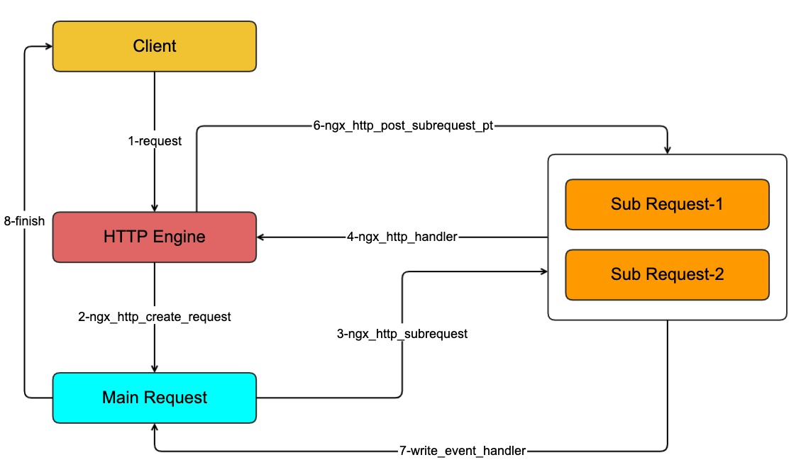

### nginx子请求介绍

| author | update |
| ------ | ------ |
| perrynzhou@gmail.com | 2020/11/20 |

###  背景

- Nginx http框架定义了4种模块:handler、fileter、upstream、balance模块，这4种模块相互协作完成绝大多数http请求，但是它也有一个局限性，只能处理单一请求，完成一个任务，对于要执行多个请求才能完成的复杂任务无无能为力。比如，向不同的上游服务器获取数据，最终整理汇总一个结果给客户端，显然这是无法做到的
- 如果在客户端，请求多个资源这是没有问题的，分别向nginx发送请求,得到每个响应数据后整理汇总即可，这种方法是有弊端的，比如增加客户端实现的复杂度，同时效率也得不到保证。
- 如果在服务端，可以把一个请求拆分为多个子请求，每个请求在服务端走内部的处理流程,然后在汇总结果返回给客户端，这种方式效率比较高，这个也是nginx子请求的设计

### 框架简介

- 由客户端发起http请求成为主请求,它直接和客户端通信，解析完请求行和请求头后进过nginx处理引擎的11个处理阶段，最终产生响应数据输出，这是典型的RPC。
- 子请求时有nignx内部发起的http请求，因为已经在nignx的服务内部,所以它不需要建立TCP连接，也没有协议解析的成本，直接找到对应的location进去处理引擎进行处理，相对于主请求资源消耗更少，这是一个典型的本地调用。
- 子请求和主请求额功能、处理流程基本相同，都是由nginx的http处理引擎处理，使用相同的handler和filter模块，主要区别是两者的发起方式。子请求时nginx内部的调用，不涉及TCP连接。主请求是远程调用，需要建议TCP连接。
- 子请求也有功能限制，因为不建立TCP连接，所以只能调用本server块内得location。不过利用upsteam机制，在location块中配置proxy_pass等反向代理指令访问其他服务器。

### 子请求的工作原理

- 主请求可以发送多个子请求，并且子请求还可以在发起子请求，形成树状的调用层次。由于存在多级请求树，所以发起子请求的成为父请求。主请求只能有一个，而父请求是发起当前请求的上一级请求，主请求一定是父请求，而父请求不一定是主请求。
- 发起子请求的流程大体如下：
  - 客户端发起请求(主请求),有nginx处理
  - 主请求调用ngx_http_subrequest创建子请求对象，加入到待处理的请求链表中
  - 主请求返回ngx_done,暂停主请求执行，等到所有子请求处理完成
  - http处理引擎从待处理的请求链表中取出子请求，进行处理,子请求的处理过程和主请求相同，同时子请求还可以发起子请求
  - 子请求处理完毕,使用回调函数通知主请求继续运行
  - 主请求获取所有子请求的响应数据，整理加工返回给客户单