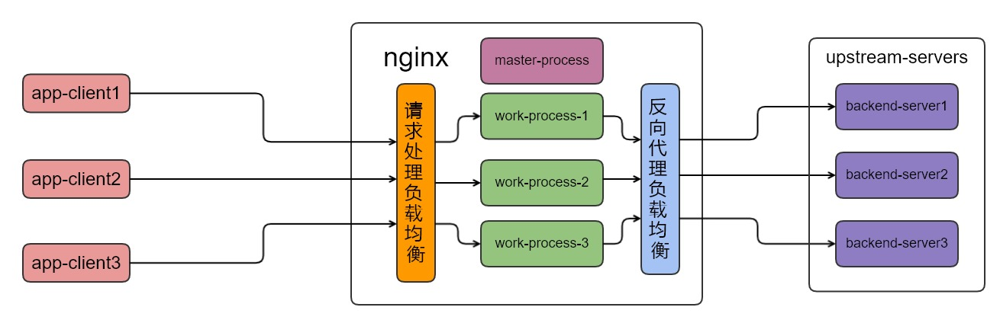

## nginx 负载均衡

| 作者 | 时间 |QQ技术交流群 |
| ------ | ------ |------ |
| perrynzhou@gmail.com |2020/12/16 |中国开源存储技术交流群(672152841) |

### nginx负载均衡类型

 

- 一种负载均衡是针对应用程序请求nginx时候发生的,nginx 根据每个工作进程当前压力调整它们获取监听套接字的机率，那些当前比较空闲的工作进程有更多的机会获取监听套接字，从而当应用程序请求到达时候也相应被比较空闲的worker进程进行处理。
- 另外一种是nginx是以反向代理形式运行时候发生的,那么请求实际的处理需要转发到反向代理的后端服务器，如果反向代理后端服务器有多台,如何选择合适的一台后端服务器处理请求，这也是nginx作为反向代理时候的负载均衡策略

### nginx 反向代理提供5种负载均衡模式

- round robin(轮询)策略
  - 每个请求按照时间顺序逐一分配到不同的后端服务器，如果后端服务器宕机，能自动剔除 
- ip_hash(基于IP哈希)策略
  - 每个请求按照访问的IP的进行哈希，根据这个哈希来选择后端一个节点，同样IP请求会落到后端同一个服务器上，可以解决session共享问题
- least connection(最少连接)策略
  - 下一个请求将会分配到后端连接数最少的服务器上，这个也是基于负载的一种策略
- weight(基于权重weight)策略
   - weight的值越大分配到的访问概率就越高，这个策略主要用于反向代理后端服务器性能不均衡的情况下，合理利用后端服务器资源的一种策略
- random(随机)策略
  - 随机策略在大量请求情况下，按照概率的理论约等于在round robin策略