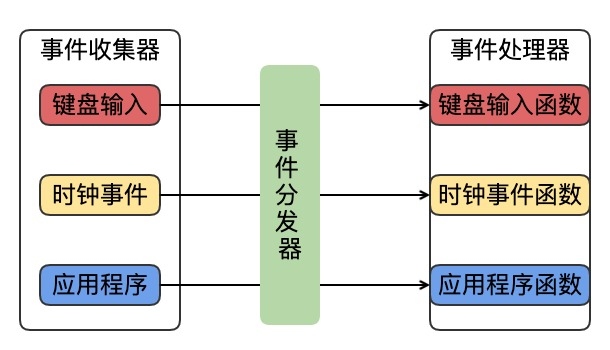

## nginx事件驱动模型

| author | update |
| ------ | ------ |
| perrynzhou@gmail.com | 202/10/12 |

### 事件驱动模型介绍

- 事件驱动模型一般有三个部分组成:事件收集器、事件分发器、事件处理器。
  - 事件收集器,负责收集所有的事件，包括来自用户、自软件、硬件
  - 事件分发器，负责把收集的事件分发到目标对象上，目标对象就是事件处理器的位置
  - 事件处理,负责具体事件的响应工作。
