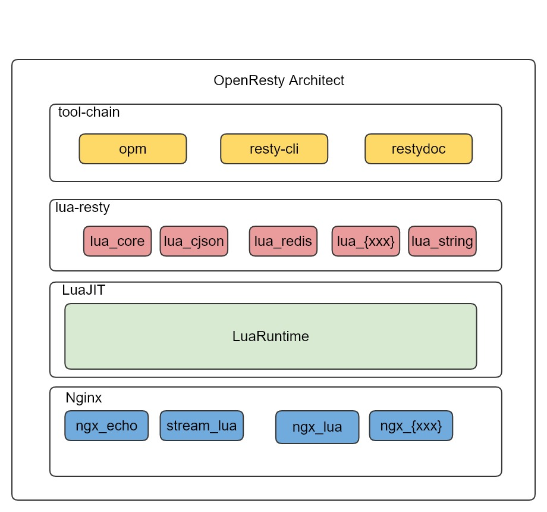

## OpenResty基本介绍

| 作者 | 时间 |QQ技术交流群 |
| ------ | ------ |------ |
| perrynzhou@gmail.com |2020/11/27 |中国开源存储技术交流群(672152841) |

### OpenResty架构

###  简介
- openResty是一个基于Nginx与Lua的高性能Web平台，其内部集成了大量精良的Lua库、第三方模块以及大多数的依赖项。用于方便地搭建能够处理超高并发、扩展性极高的动态Web应用、Web 服务和动态网关。OpenResty通过汇聚各种设计精良的Nginx模块(主要由OpenResty团队自主开发)，从而将Nginx 有效地变成一个强大的通用 Web 应用平台。这样，Web 开发人员和系统工程师可以使用 Lua 脚本语言调动Nginx 支持的各种C以及Lua 模块，快速构造出足以胜任10K乃至1000K以上单机并发连接的高性能Web应用系统。
- openResty的目标是让你的Web服务直接跑在Nginx服务内部，充分利用 Ng非阻塞I/0模型，不仅仅对HTTP客户端请求，甚至于对远程后端诸如MySQL、PostgrMemcached以及Redis等都进行一致的高性能响应
- - OpenResty以nginx为核心，集成打包众多侧重于高性能web开发的外围组件(记住也是外围组件)，OpenResty既是一个webserver,也是一套比较成熟的开发套件

### OpenResty组成
- openResty组成是由核心组件、nginx组件、
- 核心组件包括如下4个部分
  - nginx:高性能web服务器，支持正向/反向代理、负载均衡
  - LuaJIT:高性能lua语言解释器/编译器
  - ngx_lua:处理http协议，让lua程序嵌入到nginx里面运行
  - stream_lua:处理tcp/udp协议
- Nginx组件，openresty中的nginx组件都是以C模块方式提供，集成在nginx内部，常用模块有如下：
  - ngx_iconv:转换不同的字符集
  - ngx_encrypted:使用AES-256算法执行简单的加密运算
  - ngx_echo:提供一些列echo风格命令和变量
  - ngx_set_misc:增强set_xxx指令，用来操作变量
  - ngx_headers_more:更方便处理http请求头和响应的指令
  - ngx_memc:执行各种memcache操作
  - ngx_redis2:支持各种Redis操作
  - ngx_dizzle:支持各种mysql的操作
  - ngx_postgres:支持各种postgres操作

- Lua组件,openresty中lua组件通常以lua源代码方式提供，个别组件为了性能会以C语言实现，是动态链接库形式
  - lua_core:openresty的核心功能库
  - lua_cjson:处理json核心数据，速度很快
  - lua_string:hex/md5/sha1/sha356等字符串功能
  - lua_upload:流式读取http的上行数据
  - lua_healthcheck:后端集群健康检查
  - lua_limit_traffice:定制流量控制策略
  - lua_lock:基于共享内存的非阻塞锁
  - lua_lrucache:高效的lru花村功能策略
  - lua_dns:dns解析功能
  - lua_websocket:非阻塞的websocket功能
  - lua_redis:redis客户端端，比lua_redis2更加灵活
  - lua_memcached:memcached客户端
  - lua_mysql:mysql客户端

- 辅助工具，提供openresty辅助开发、调试、运维等工具。openresty提供如下3个辅助工具
  - opm,类似于rpm/npm等管理工具，用来安装各种组件
  - resty-cli:以命令形式直接执行openresty/lua程序
  - restydoc:类似于man手册