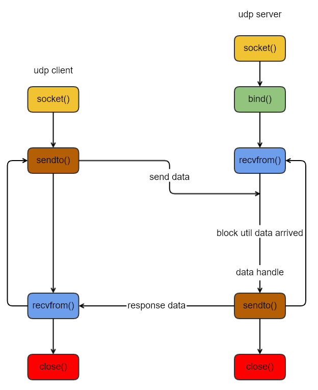

## UDP编程初探

| 作者 | 时间 |QQ技术交流群 |
| ------ | ------ |------ |
| perrynzhou@gmail.com |2020/11/23 |中国开源存储技术交流群(672152841) |

### 介绍

- UDP提供无连接不可靠的数据报协议，不同于提供TCP面向连接可靠的数据字节流
- UDP常用在DNS，NFS和SNMP等
- 典型的UDP的C/S模型，客户端和服务器不需要建立连接，而是只管使用sendto函数给服务器发送数据报，其中必须指定服务器的地址作为sendto函数的参数；服务器端不接受来自客户端的连接，而是调用recvfrom函数，等待来自客户端的数据到达。
